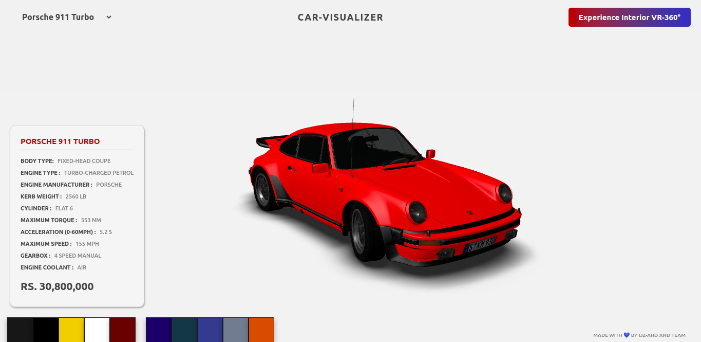

# Car-Visualizer

Car Visualizer is a realtime 3D environment representing cars and providing VR-Experience for the user online. It showcases the car and provision the user have the ability to customize the color of car, switch between different cars and also view the cockpit panoramic VR-360° view. This project runs smooth and perfect on most of the modern / old browsers supporting WEBGL. (Inspired from THREEJS Community)

## Pre-requisites

- Fundamental Requirements:

  - [nodeJS(Javascript)](https://nodejs.org/en/)
  - [npm](https://www.npmjs.com/)

- Project Dependencies:

  - THREEJS - To load the scene, environment and all the dependencies to run the app
    - GLTFLoader - To load 3D models of .glb / .gltf extension
    - OrbitControls - For the provision of controlling scene's camera access to user
  - A-Frame - To provide VR-Experience for user
  - ExpressJs - To make a server that provides static content to user

- Execution Dependencies:
  - Browser with WEBGL support

## Installation

Use [npm](https://www.npmjs.com/) package manager for installations.

Use command to install all the project dependencies

```bash
npm install
```

Use command to run project, this command runs the project locally at http://localhost:3000

```bash
npm start
```

Use command to run project on development mode, this command runs the project on development mode locally at http://localhost:3000

```bash
npm run dev
```

## Demonstration

Car-Visualizer running locally at http://localhost:3000



## License

[MIT](https://choosealicense.com/licenses/mit/)
